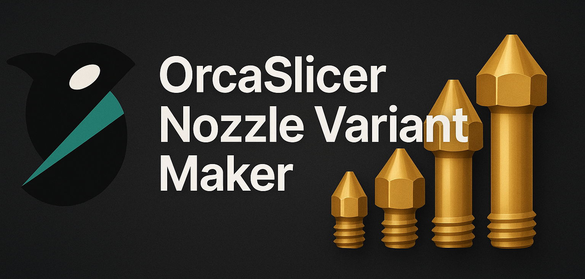
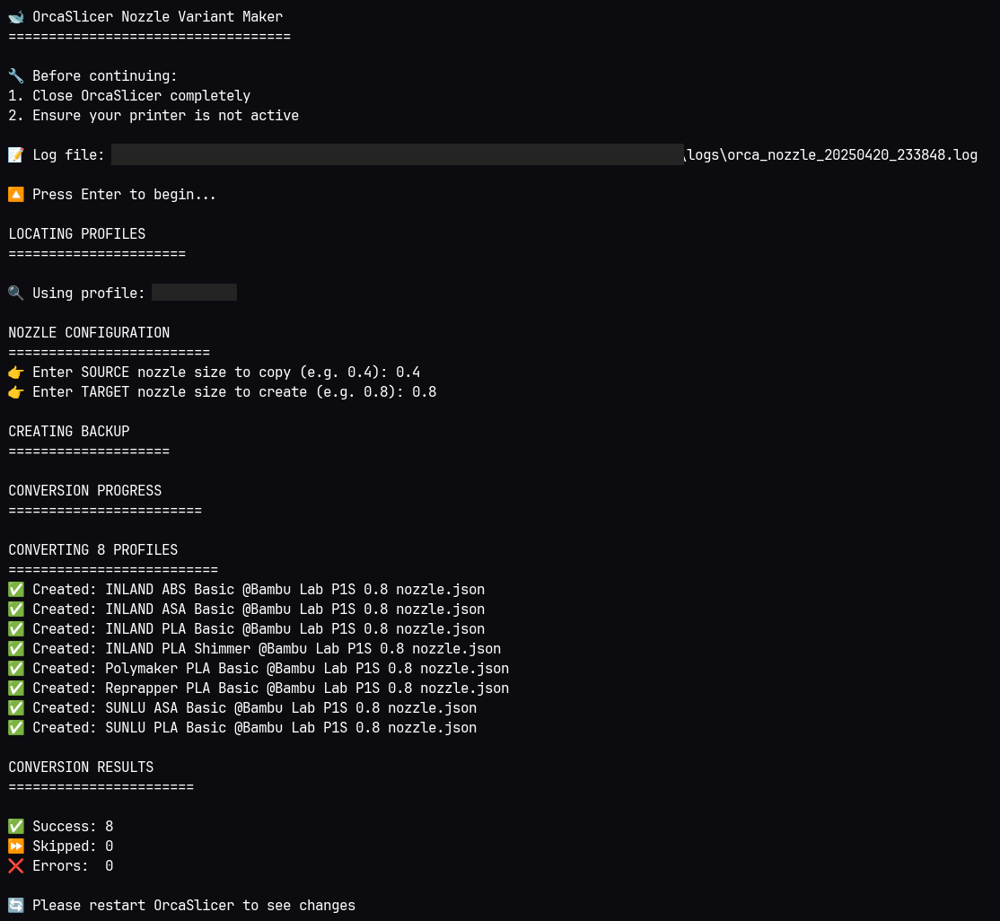

# 🐋 OrcaSlicer Nozzle Variant Maker

A user-friendly tool for batch-creating nozzle size variants in OrcaSlicer filament profiles.




For some strange reason, OrcaSlicer (and Bambu Studio) still lack the ability to automatically generate filament profile variants for different nozzle sizes. This means if you forget to set up profiles for all your nozzle sizes when creating a new filament, you're left with two bad options: start from scratch for each nozzle size, or manually duplicate and modify each profile one by one.

This tool automates that entire process. It can generate nozzle-specific variants of your filament profiles in bulk, adjusting settings as needed for the new nozzle size. It also integrates smoothly with Bambu's cloud services (if enabled). Best of all, it works non-destructively and doesn't install anything on your system—aside from the new profiles it creates.

## 📦 Using the Official Release

For most users, the easiest way to get started is by downloading the latest release from the [Releases](https://github.com/cypress-exe/orcaslicer-nozzle-variant-maker/releases) page.

1. **Download the executable** for your operating system.
2. **Close OrcaSlicer** ⚠️ - Required to prevent conflicts!
3. **Run the executable**:
   - On Windows: Double-click the `.exe` file.
   - On macOS/Linux: Run the executable from the terminal or file manager.
4. **Follow the prompts**:
   ```
   1️⃣ Press Enter to begin
   2️⃣ Select profile directory (if not auto-detected)
   3️⃣ Choose user configuration (if not auto-detected)
   4️⃣ Enter source nozzle size (existing)
   5️⃣ Enter target nozzle size (new)
   6️⃣ Let the tool create backups and new profiles
   ```
5. **Restart OrcaSlicer** to see new profiles.

## ✨ Features

- 🔍 Auto-discovers OrcaSlicer profiles
- 💾 Automatic backups before making changes
- 📝 Detailed logging for troubleshooting
- ♻️ Non-destructive operation (never modifies originals)
- 🎮 Interactive command-line interface
- 🚦 Safety checks and validations
- 📁 Supports multiple user configurations

## 👩‍💻 Building from Source

If you prefer to build the tool from source or want to modify it, follow these steps:

1. **Requirements**:
   - Python 3.6+
   - OrcaSlicer installed

2. **Download the source code**:
   ```bash
   git clone https://github.com/cypress-exe/orcaslicer-nozzle-variant-maker.git
   cd orcaslicer-nozzle-variant-maker
   ```

3. **Run the tool**:
   ```bash
   python3 orcaslicer_nozzle_variant_maker.py
   ```

## 🛠️ How It Works

1. **Profile Discovery**:
   - Scans `user/*/filament/base` directories
   - Groups profiles by material type
   - Shows variant counts (0.4mm, 0.6mm, etc)

2. **Safety Backup**:
   - Creates timestamped `backup_YYYYMMDD_HHMMSS`
   - Copies all JSON profiles
   - Provides restore instructions

3. **Profile Conversion**:
   - Creates new `[material] @ [size].json` files
   - Updates compatible printers list
   - Generates new unique IDs

4. **Logging**:
   - Stores detailed logs in `logs/`
   - Keeps last 10 log files
   - Records system info for debugging

## 🔒 Safety Features

- 🛑 Never modifies existing profiles
- 💾 Mandatory backups before changes
- ✅ Input validation for nozzle sizes
- 🔄 Atomic file operations
- 📁 Original files remain untouched

## 🚨 Troubleshooting

Common Issues:
- **Profile directory not found**  
  Verify OrcaSlicer's installation path
- **No profiles detected**  
  Ensure you have existing nozzle profiles
- **JSON errors**  
  Check log files in `logs/` directory

Logs contain:
- Full error stack traces
- System configuration
- Operation timestamps
- File paths and modifications

## 📜 License

MIT License - See [LICENSE](_LICENSE_) file

---
  
**Happy Printing!** If you enjoy this tool, please consider starring the repo ⭐